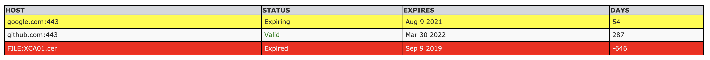
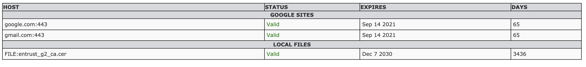

# ssl-pooch
## SSL certificate checker, scrapper, monitor and more...

     

<br/> _"I was working on a flat tax proposal and accidentally made this."_
<br/>
---  
<br/><br/>

## What
- Check, scrap and monitor SSL certificates
- It can be used against host, local file (PEM/SAML IdP Metadata XML), resource URL or thru a list of servers, local files and URLs
- Generate several output types <small>(CSV, HTML, JSON, AWS CloudWatch, CA Wily Introscope, Broadcom DXAPM, StatsD (DataDog/Influx), Prometheus and ElasicSearch APM... so far.)</small>
- Send results by email
- Inject results to instrumentation endpoint
- Ship with Docker
- Schedule for crontab
- Bark!

---

* [Usage](#Usage)
    * [Configuration](#CONFIGURATION)
    * [Remote host](#REMOTE-HOST)
    * [Local file](#LOCAL-FILE)
    * [Resource URL](#RESOURCE-URL)
    * [List](#LIST)
        + [Separators](#Separators)
        + [Alternative Labels](#Alternative-Labels)
        + [Static fields](#Static-fields)
        + [Order results](#Order-results)
        + [Filter results](#Filter-results)
* [Formatting options](#Formatting-options)
    + [Output type](#Output-types)
        + [tty](#tty)
        + [csv](#csv)
        + [html](#html)
        + [json](#json)
        + [cw](#cw)
        + [wily](#wily)
        + [dxapm](#dxapm)
        + [statsd](#statsd)
        + [prometheus](#prometheus)
        + [graphite](#graphite)
        + [esapm](#esapm)
    + [Show extra fields from certificate](#Extra-fields)
    + [Omit header](#Omit-header)
* [Misc options](#MISC-OPTIONS)
    + [Send results by email](#Send-results-by-email)
    + [Save restuls to file](#Save-results-to-file)
    + [Export certificate from endpoint](#Export-certificate-from-endpoint)
    + [Show progress bar when running over a list](#Show-progress-bar-when-running-over-a-list)
    + [Inject results to instrumentation endpoint](#Inject-results-to-instrumentation-endpoint)
    + [Debug execution](#Debug-execution)
    + [Show version](#Show-version)
* [Stamin for unreachable endpoints](#Stamin-for-unreachable-endpoints)
* [Custom Configs](#Custom-Configs)
* [Exit codes](#Exit-codes)
* [Requires](#Requires)
* [Run with Docker](#Run-with-Docker)
* [Tested on](#Tested-on)
* [Todo](#Todo)
* [Bugs](#Bugs)
* [Change log](#Change-log)
* [References](#References)

## Usage
```
$ ./ssl-pooch.sh -h

ssl-pooch (woof-woof) v1.0

 USAGE
      ./ssl-pooch.sh [manual|-v] [-n|-x|-m|-i]
      { [-s HOST -p PORT] | [-f LOCAL_CERTIFICATE_FILE] [-l FQDN_LIST_FILE] [-u RESOURCE_URL] }
      [-t(tty|csv|html|json|cw|wily|dxapm|statsd|prometheus|graphite|esapm)]
      [-e(issuer,cn,serial)] [-S]
      [-o/-or(column_number)] [-F/-F-(pattern)] [-O save_to_file]

 FOR MORE INFO
      ./ssl-pooch.sh manual
```

## CONFIGURATION
You can either change values on top of the script or use a **conf/config.ssl-pooch.env**. If config file is found, valid and executable, it will be sourced and any varible set there will have prevalence over the ones on the script replacing theirs equivalents. 

Check out all available configs at [Custom Configs](#Custom-Configs) section.

## Moooore (aka manual)
## REMOTE HOST
```
$ ./ssl-pooch.sh -s HOST -p PORT
```

### Where
```
-s    : Hostname/IP address to query certificate of
-p    : SSL/Secure Port number. If not specified, '443' is assumed.
```

### Example
```
$ ./ssl-pooch.sh -s google.com -p 443
Host            | Status  | Expires     | Days
google.com:443  | Valid   | Aug 2 2021  | 58
```

## LOCAL FILE
```
$ ./ssl-pooch.sh -f LOCAL_CERTIFICATE_FILE
```

### Where
```
-f    : Local certificate file path
```

- PEM certificates and SAML IdP Metadata XML Certificates (this last one is probably only useful to me) are supported.

### Example #1 (PEM file)
```
$ ./ssl-pooch.sh -f ~/Certs/Entrust_G2_CA.cer
Host                    | Status  | Expires     | Days
FILE:Entrust_G2_CA.cer  | Valid   | Dec 7 2030  | 3472
```
### Example #2 (SAML IdP Metadata XML)
```
$ ./ssl-pooch.sh -f sp-gst-stage-metadata.xml 
Host                            | Status  | Expires      | Days
FILE:sp-fed-proxy-metadata.xml  | Valid   | Jun 12 2031  | 3648
```

## RESOURCE URL
```
$ ./ssl-pooch.sh -u RESOURCE_URL
```

### Where
```
-u    : Resource URL to download the cert from
```

- PEM certificates and SAML IdP Metadata XML Certificates (this last one is probably only useful to me) are supported.

### Example
```
$ ./ssl-pooch.sh -u http://mysite.com/download/certfile.cer
Host                                    | Status    | Expires       | Days
URL:mysite.com/download/certfile.cer    | Valid     | Jun 20 2031   | 3650
```

## LIST
```
$ ./ssl-pooch.sh -l FQDN_LIST_FILE [-o(n)|-F(-)]
```

- **NOTE**: Execution may look hang when running with a bigger list file, it's not. This is just like bankruptcy law... Don't worry about it. I got this! In case you've have trust issues you can use a [progress bar](#Show-progress-bar-when-running-over-a-list) to see where things are going.

### Where
```
-l    : List file containing certs to go thru, fields must be split by spaces as:
HOST PORT
```

### Example list #1
```
google.com 443
github.com 443
```

- You can include local files on list using **FILE** keyword, as:
```
CERT_FILE_PATH FILE
```

### Example list #2
```
/home/user/certs/cert1.pem FILE
/home/user/certs/cert2.pem FILE
```

Considering below list file, for example:
```
google.com 443
/home/user/certs/Entrust_G2_CA.cer FILE
```

Results will be:
```
$ ./ssl-pooch.sh -l list
Host                   | Status  | Expires      | Days
google.com:443         | Valid   | Aug 2 2021   | 58
FILE:Entrust_G2_CA.cer | Valid   | Dec 7 2030   | 3472
```

- As well, you can do exactly the same with **URL** keyword to include it on a list.

### Separators

If you running thru a list and generating a [html](#html) output (exclusively), you can use a **separator** to well... separate things. Like:

### Example list with separator
```
_separator;Google Sites
google.com 443
gmail.com 443
_separator;Local Files
/home/user/certs/Entrust_G2_CA.cer FILE
```

- **_separator** must be written as - **_separator;HEADER_NAME**, example:
```
_separator;EXTERNAL SITES
```

- ignored if output type is not [html](#html)
- ignored if **[ordering](#Order-results)** OR **[filtering](#Filter-results)** results
- ignored if **[header is omitted](#Omit-header)**

### Alternative Labels

When running against a list, you can opt for an alternative label to be shown instead of default output (host:port, file:FILE, url:URL), just put the label you want before HOST/FILE/URL and split them with a **';'** (semicolon), like:"
```
GOOGLE;google.com 443
```

Results will be shown as:
```
$ ./ssl-pooch.sh -l list
Host             | Status       | Expires      | Days
GOOGLE           | Valid        | Sep 14 2021  | 67
```

- Note that all info about the endpoint (host/file/url/port) is ommited when alternative label is used.
- Alterntive label can **NOT** have spaces on it.

### Static fields

- You can also use static fields on the list file - your own identifiers for example, whatever you need. This is specially useful when you require some 'shape' on a bigger list.
- Static fields are limited to the max of **three(3)** fields - output starts to get ugly.

- In order to use static fields, you need to define custom variables, as follow:
    + **_custom_static_fields_pos** : Where to position the fields on the results as **'begin'** or **'end'**
    + **_custom_static_fields_names** : Array containing static fields names to be used on header.

Finally, to have static fields working properly you need to put them on the begging of the line as:
```
STATIC_FIELD_1 STATIC_FIELD_2 STATIC_FIELD_3 <HOST|PATH> <PORT|FILE>
```

### Example list #3
```
MainApp Production JackOfAllTrades google.com 443
```

Wrapping it all... Let's take below list with static fields for instance:
```
App1 Eric_Schmidt Mountain_View google.com 443
App2 Chris_Wanstrath San_Francisco github.com 443
```

Note that static fields and its headers names can **NOT** have spaces on it. The best you can use is **'_' (underline)** - I could'nt find a way to parse it without issues, hard to test all inputs; the less of evils... Going further and considering above list file, and as stated before, assuming you'd set custom static field variables, position and header names, example:
```
_custom_static_fields_pos="begin"
_custom_static_fields_names=("Id" "Chairman" "Headquarters")
```

Finally, using said list, you get:
```
$ ./ssl-pooch.sh -l list
Id    | Chairman        | Headquarters    | Host            | Status  | Expires      | Days
App1  | Eric_Schmidt    | Mountain_View   | google.com:443  | Valid   | Aug 2 2021   | 58
App2  | Chris_Wanstrath | San_Francisco   | github.com:443  | Valid   | Mar 30 2022  | 298
```

_Woo-hoo! Four day weekend, hun?!_

### Order results
```
-o    : Sort/order output by column number (nth); reverse order with 'r', example:
-o2   : Sort results by column number 2
-or2  : Sort results in reverse order by column number 2
```

You can also order by two columns, like - order by column A then by column B, example:
```
-o1,4   : Sort by column number 2, then by column number 4
-or1,4  : Sort results in reverse order column number 2, then by column number 4
```

- Ignored depending on the output type
- Ignored if specified column number is out of bounds, example: used '6' on a run that yields a '5' columns output.

### Filter results
```
-F    : Filter output by pattern, whenever it exists - void with '-'
```

Applies to any column or value, example:
```
-FValid           : Show only lines that contains 'Valid'
-F-Unreachable    : Do not show lines containing 'Unreachable'
-F-site1.com      : Do not show lines containing 'site1.com'
```

## FORMATTING OPTIONS
### Output types
```
-t     : Output type. If not specified, 'tty' is assumed.
```

### Accepted values are
### tty
Pretty console \*default
```
$ ./ssl-pooch.sh -s google.com
Host            | Status  | Expires     | Days
google.com:443  | Valid   | Aug 2 2021  | 58
```

### csv
Delimiters gonna rule and delimit
```
$ ./ssl-pooch.sh -s google.com -tcsv
Host;Status;Expires;Days
google.com:443;Valid;Aug 2 2021;57
```

### html
Eich tee eme ell. Lynx? Netscape?
```
$ ./ssl-pooch.sh -s google.com -thtml
<!DOCTYPE HTML PUBLIC "-//W3C//DTD HTML 4.01//EN" "http://www.w3.org/TR/html4/strict.dtd"><html><head><title>ssl-pooch</title>
<meta http-equiv="Content-Type" content="text/html; charset=utf-8"/>
<style type="text/css">
        body {
            margin: 1 0 0 2;
            padding: 0;
        }
        font {
            font:normal 12px verdana, arial, helvetica, sans-serif;
        }
        table {
            background:#f9f9f9;
            border:1px solid black;
            border-collapse:collapse;
            font:normal 12px verdana, arial, helvetica, sans-serif;
            width:80%;
        }
        td {
            padding:.4em;
            text-align:left;
            border:1px solid black;
            width:max-content;
        }
        td.health {
            background:green;
        }
        th {
            color:#2E2E2E;
            background:#d5d8dc;
            text-align:left;
            border:1px solid black;
            text-transform:uppercase;
            font:bold 12px verdana, arial, helvetica, sans-serif;
            width:max-content;
        }
        tr {
            color:#2E2E2E;
            border:1px solid black;
        }
        tr.warning{
            color:#2E2E2E;
            background:yellow;
        }
        tr.critical{
            color:#F2F2F2;
            background:red;
        }
</style></head><body><br/><table><tr><th>Host</th><th>Status</th><th>Expires</th><th>Days</th></tr><tr><td>google.com:443</td><td class="health">Valid</td><td>Aug 2 2021</td><td>57</td></tr></table></body></html>
```

#### Example HTML output


#### Example HTML output with separators


### json
Get your gollie mask on! RFC 8559 compliant JSON
```
$ ./ssl-pooch.sh -s google.com -tjson
[   { "Host" : "google.com:443","Status" : "Valid","Expires" : "Aug 2 2021","Days" : "57" }   ]
```

### cw
AWS CloudWatch PutMetric custom var **_custom_cw_namespace** must be set
```
$ ./ssl-pooch.sh -s google.com -tcw  
aws cloudwatch put-metric-data --metric-name "google.com" --dimensions "URL=google.com,Status=Valid" --namespace "SSL Monitoring" --value "57" --unit "days" --timestamp 1623017695
```

- **_custom_cw_namespace** should have CM namespace, example:
```
_custom_cw_namespace="SSL Monitoring"
```

### wily
CA Wily Introscope metric custom var **_custom_wily_metric_path** must be set
```
$ ./ssl-pooch.sh -s google.com -twily
<metric type="IntCounter" name="Infrastructure|fmattos|SSL:google.com" value="57" />
```

- **_custom_wily_metric_path** is meant for metric path within Wily's tree, example:
```
_custom_wily_metric_path="Infrastructure|$(hostname -s)|SSL:"
```

### dxapm
Broadcom DX APM metric custom var **_custom_dxapm_metricset** must be set
```
$ ./ssl-pooch.sh -s google.com -tdxapm
{ "agent" : "Infrastructure", "host" : "fmattos", "metrics" : [ { "name" : "SSL|Validity:Days", "type" : "IntCounter", "value" : "57" },{ "name" : "SSL|Validity:Status", "type" : "IntCounter", "value" : "0" } ] }
```

- **_custom_dxapm_metricset** must be set to: metric tree name AND metric node. Example:
```
_custom_dxapm_metricset=("Infrastructure" "SSL|Validity")
```

### statsd
Statds metric, suitable for DataDog and Influx custom var **_custom_statsd_metric_name** must be set
```
$ ./ssl-pooch.sh -s google.com -tstatsd
ssl.certificate,endpoint=google.com:57|g
```
- **_custom_statsd_metric_name** holds the metric name, example:
```
_custom_statsd_metric_name="ssl.certificate,endpoint"
```

### prometheus
Prometheus metric custom var **_custom_prometheus_metricset** must be set

- **_custom_prometheus_metricset** variable should be set as: include metadata (true/false) AND metric name AND label name, example:
```
_custom_prometheus_metricset=("true" "ssl_certificate_validation" "endpoint")
```

```
$ ./ssl-pooch.sh -s google.com -tprometheus
# HELP ssl_certificate_validation SSL Certificates Days To Expiration
# TYPE ssl_certificate_validation gauge
ssl_certificate_validation{endpoint="google.com"} 57 1623171994
```
...or without metadata header, depending on the metricset value
```
$ ./ssl-pooch.sh -s google.com -tprometheus
ssl_certificate_validation{endpoint="google.com"} 57 1623171994
```

### graphite
Graphite metric custom var **_custom_graphite_metric_name** must be set
```
$ ./ssl-pooch.sh -s google.com -tgraphite
infrastructure.ssl.certificate.days.google_com 57 1623018363
```

- **_custom_graphite_metric_name** is the Graphite metric name, like:
```
_custom_graphite_metric_name="infrastructure.ssl.certificate.days"
```

### esapm
ElasticSearch APM metric custom var **_custom_esapm_metricset** must be set
```
$ ./ssl-pooch.sh -s google.com -tesapm   
{ "metricset" : { "tags" : { "infrastructure" : "ssl", "status" : "Valid" }, "timestamp" : "1623018377",  "samples" : { "days.google_com" : { "value" : "57" } } } }
```

- **_custom_esapm_metricset** has the values of: master_label AND sample name, example:
```
_custom_esapm_metricset=("infrastructure" "ssl")
```

### Extra Fields
```
-e     : Show extra info from certificate.
```

### Accepted values are:

- cn : Certificate common name
- issuer : Certificate issuer
- serial : Certificate serial

### Use one argument or any combination of them, separated by commas, like:
```
./ssl-pooch.sh -s google.com -ecn
./ssl-pooch.sh -s google.com -ecn,serial
./ssl-pooch.sh -s google.com -ecn,serial,issuer
```

### Example
```
$ ./ssl-pooch.sh -s google.com -ecn,serial,issuer
Host            | Issuer  | CNAME         | Serial                            | Status  | Expires     | Days
google.com:443  | GTS     | *.google.com  | BFF10D86136F613D0300000000CC17DE  | Valid   | Aug 2 2021  | 57
```

### Certificate SANs
```
-S      : Show certificate SANs, if any (output may get VERY ugly)
```

### Example
```
$ ./ssl-pooch.sh -s github.com -S
Host                                                 | Status  | Expires      | Days
github.com:443 (DNS:github.com, DNS:www.github.com)  | Valid   | Mar 30 2022  | 248
```

### Omit header
```
-n     : Do not show header ** Ignored depending on the output type
```

### Example
```
$ ./ssl-pooch.sh -s google.com -n
google.com:443  | Valid  | Aug 2 2021  | 57
```

## MISC OPTIONS

### Send results by email

- Depends on **sendmail** (not quite, but yes)
```
-m     : Send results by email
```

- Custom variables must be set, as follow:
    + **_custom_mail_to** : recipient's email/s. split multiple emails with commas, as: mail1,mail2
    + **_custom_mail_from** : sender's email
    + **_custom_mail_subject** : email subject

- Did I say it **not quite** depends on sendmail? Yep. You can use **telnet** instead, obviously, assuming your mailhost can reply to EHLOs. If you want to use telnet for sending emails, you gotta set an additional custom variable:
    + **_custom_mail_usealtmechanism** : settings for alternative telnet email mechanism; must have true|false, domain.com, mailhost_addr, mailhost_port
    
When it's first element is set to **true**, it will choose telnet for sending emails. Ex:
```
_custom_mail_usealtmechanism=("true" "company.com" "mailhost.company.com" "25")
```

### Save results to file
```
-O     : Save results to <file> *default to stdout
```

### Example
```
$ ./ssl-pooch.sh -s google.com -O results
$ cat results
Host            | Status  | Expires     | Days
google.com:443  | Valid   | Aug 2 2021  | 56
```

### Export certificate from endpoint
```
-E      : Export certificatee file to PWD/cert_files
```

Export the endpoint certificate to **PWD/cert_files**
- This is only valid when running against server or URL

### Show progress bar when running over a list

Meh is it running? I wanna seeeee it...

```
-P      : Show progress bar when running over a list
```

### Inject results to instrumentation endpoint
```
-i     : Send results to instrumentation endpoint
```

- Custom variables must be set, as follow:
    + **_custom_instrumentation_addr** : instrumentation endpoint server/URL
    + **_custom_instrumentation_cmd** : command to be used for metric injection" 

Example:
```
_custom_instrumentation_addr="http://localhost:5001/metricfeed"
_custom_instrumentation_cmd="curl --silent -i -H \"Content-type: application/json\" -XPOST ${_custom_instrumentation_addr}"
```

### Debug execution
```
-x     : Debug execution. Ye ol' and ugly friend 'set -x'
```

### Example
```
$ ./ssl-pooch.sh -x
++ command -v true
+ _rm_cmd=true
... [continues]
```

- All temporary files are left behind when '-x' is used, they can be useful.

### Show version
```
-v     : Version information
```

**Some options and/or arguments are mutually exclusive and will either fail or be ignored.**

## Stamin for unreachable endpoints

_choo choose local files..._
  
There is a 'pseudo retry' function for whenever an endpoint is found unrechable, it can search for the correlated local certificate on the **_local_certs_path** - controlable by the variable **_seek_local_certs** - which should be true or false. Important to mention that said files should follow a specific naming pattern to be 'seen', that's the same naming convention used when exporting a certificate, like for example:

- SERVER
    + server name and port: **google.com 443**
    + local file should be named: **google.com_443.cer**
- URL
    + URL: **https://google.com/files/certificates/file**
    + local file should be named: **google.com_files_certificates_file.cert**

If that happens, endpoint unreachable AND _seek_local_certs is 'true' AND correlated file found on _local_certs_path, a notation as **'local'** will be placed on the line to indicate date was pull from a local file, example:"
```
$ ./ssl-pooch.sh -s google.com
Host                    | Status  | Expires     | Days
google.com:443 (local)  | Valid   | Oct 4 2021  | 50
```

## Custom Configs

Listing all of them et their meaning... 

### Common
- **_warning_notice**    : how many days should be considered warning? anything less than this set will be seen as a warning; set to 30 by default.
- **_openssl_proxy**     : HTTP proxy to be used with OpenSSL \* when available to OpenSSL (v2.0+)
    + setting _openssl_proxy will make all calls run over the proxy
    + if empty, will use ENV ALL_PROXY if available; and finally ignore if it's not set
    + when proxy is set, discovery is skipped and all hosts are treated as live"
- **_seek_local_certs**  : whether to seek or not for local certs when [endpoint is unreacheable](#Stamin-for-unreachable-endpoints) should be true or false
- **_local_certs_path** : where to seek for local files

### Email Variables
- **_custom_mail_usealtmechanism**   : use alternative email mechanism thru telnet? if not set, sendmail will be used. to be considered, this var should be set as: "true|false" "domain" "mailhost_addr" "mailhost_port" - obviously only considered if first element is 'true'
- **_custom_mail_to**    : recipient's email/s. split multi-addr with commas, as: addr1,addr2.
- **_custom_mail_from**  : sender's email  
- **_custom_mail_from_return_path**  : use different return path or reply-to?
- **_custom_mail_subject   : email subject
- **_custom_mail_signature : email signature - must use HTML escaped code, example:
```
_custom_mail_signature="<p><span style=\"signature\">A Rocksome SSL Monitoring Tool</span></p>"
```
- **custom_html_style**  : custom email stylesheet for HTML emails - must use HTML escaped code

### Output Specic Variables
- **_custom_static_fields_pos**  : where to position static fields 'begin' OR 'end' of the line
- **_custom_static_fields_names**: static fields names to be used on headers
- **_custom_wily_metric_path**   : CA WILY - apm metric path - to be used with correlated output
- **_custom_dxapm_metricset**    : DX APM - DX apm metric set as: agent, metric tree name, metric node
- **_custom_cw_namespace**       : AWS CLOUDWATCH - cw namespace
- **_custom_statsd_metric_name** : STATSD - statsd metric name
- **_custom_graphite_metric_name**   : GRAPHITE - graphite metric name
- **_custom_esapm_metricset**    : ELASTICSEARCH APM - elasticsearch set as: master_label, sample name
- **_custom_prometheus_metricset**   : PROMETHEUS - metricset like - include metadata (true/false), metric name, label name

### Instrumentation Endpoint 
- **_custom_instrumentation_addr**   : instrumentation endpoint URL
- **_custom_instrumentation_cmd**    : send method and command

## Exit codes
| 0 | mellow, clean/normal exit |
|-|-|
| 3 | missing dependency/var not set |
| 5 | malformed command |
| 8 | interrupted, INT caught |
| 13 | input/output/file error |
| 15 | FQDN file list related error |

## Requires
- bash v3+
- openssl
- awk
- mktemp
- column
- sed
- fold
- wget
- bc
- perl\* MacOS only
- sendmail\* When sending email
- telnet\* For alternative email mechanism

## Run with Docker

I've decided to build its Docker image based a CentOS crontab one, so one can use it to schedule job execution when needed. To run from docker, it will need to work with alternative email mechanism thru telnet - sorry, cannot make it much generic if using sendmail.

### Run
```
docker run -dt --name ssl-pooch fmattos/ssl-pooch:latest
```

### Execute
```
$ docker exec -it ssl-pooch ssl-pooch -s google.com
Host            | Status  | Expires     | Days
google.com:443  | Valid   | Oct 4 2021  | 50
```

### Use with cron

First, you may want to update container's TZ to reflect yours, it's shipped with **America/Chicago** by default. 

- Suppose you want to use **America/New_York** as your timezone, so bash into the container
```
docker exec -it ssl-pooch bash
```

- Change localtime to your TZ
```
ln -sf /usr/share/zoneinfo/America/New_York /etc/localtime
```

- Edit crontab file
```
vi /etc/crontab
```

If command goes too complex, many options and arguments for ex, you may want to create a wrapper script to call it from cron to keep it clean and safer. Your call.

## Tested on
- MacOS, BigSur 11, GNU bash, version 3.2.57 \*created on
- RHEL, Maipo 8, GNU bash, version 4.2.46
- CentOS, Core 7, GNU bash, version 4.2.46
- Ubuntu, Focal Fossa 20.04 LTS, GNU bash, version 5.0.17

## Todo
- So far, so good, so what?

## Bugs
- None that I am aware of. Let me know.

## Change log

- 0.1, initial
- 0.2, added 'timeout' function for MacOS or Unix, depending on perl.
- 0.3, made temp files more 'meaningful' - as if it matters. 
- 0.4, fixed bad coding. made 443 default port in case it's not provided.
- 0.5, added support for extra fields from cert.
- 0.6, added output types, csv/json/html.
- 0.7, added support for sending email alert.
- 0.8, added order-by and filter capabilities; CA Wily APM output type; handle all exits thru die function.
- 0.9, added statsd/prometheus/cloudwatch/graphite/esapm output; created a 'manual' (maybe it gone too far) and a quick help message.
- 1.0, added fqdn file list validation; added support to use static fields when running against a list
- 1.1, added support to parse SAML IdP Metadata XML certficate files; added (somehwhat) support to inject results to instrumentation endpoint; added support to grab certificate from a URL as a downloable resource; accepts proxy for openssl, when available, and when using it, tcp socket test will be ignored, cant run it over proxy.
- 1.2, added support to use alternative label when running against FQDN list. added support to connect to TLS mongodb. made possible to use a 'separator' on html output when running against a list. running against a list. fixed 'fold' for IdP certs with long lines. fixed few HTML bad codes. added option to show certificate SAN, output may get very ugly thou. 
- 1.3, made possible to use telnet for sending mail - yeah a big makeshift; I needed it since I want to deliver this solution on a docker container, so I dont need to waste much time dealing with postfix/mta/etc. Added a 'wrap' to use a configuration file.
- 1.4, added SIGINT to timeout, I realized it was often leaving some zombies. added '-E' option for when running against single host or URL to 'Export' the endpoint certficate, spool folder set to _this_path/cert_files. created a pseudo 'retry' for whenever an endpoint is found unreachable, so the script can seek for related local cert on spool folder (_this_path/cert_files), controlable by custom var _seek_local_certs being true or false; important to mention that files should follow a specific naming pattern (more details on the manual), if that happens (endpoint unreachable and local file found), a notation as 'local' will be put on the line to indicate data is gotten from local file. changed the 'order by' functionality so it can accept up to 2 columns to order the results - like, order by a, then b.
- 1.5, added an option to show progress when running thru a list (-P), silly but some may use it. added a signature variable so it can be used on the end of email body, also silly. removed telnet output from terminal. possibility to change HTML email style by changing _custom_html_style var. improved manual.

## References
- [SSL](https://www.ssl.com/)
- [OpenSSL](https://www.openssl.org/)
- [SiteMinder SSO](https://www.broadcom.com/products/cyber-security/identity/siteminder)
- [SAML IdP Metadata](https://en.wikipedia.org/wiki/SAML_metadata)
- [W3 Schools](https://www.w3schools.com)
- [JSON](https://www.json.org/)
- [AWS CloudWatch](https://aws.amazon.com/cloudwatch/)
- [CA Wily Introscope (outdated)](https://en.wikipedia.org/wiki/Wily_Technology)
- [Braodcom DXAPM](https://www.broadcom.com/products/software/aiops/application-performance-management)
- [StatsD](https://github.com/statsd/statsd)
- [InfluxDB](https://www.influxdata.com/)
- [DataDog](https://www.datadoghq.com/)
- [Prometheus](https://prometheus.io/)
- [Graphite](https://graphiteapp.org/)
- [ElasticSearch APM](https://www.elastic.co/apm)
